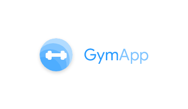

# GymApp [WORK IN PROGRESS]

GymApp is a free and open source app for keep track of your workouts at the gym.

Tha app is written in kotlin and is currently under development.

GymApp includes the following features:
* Keep track of your weight trough time
* Manage all the exercises of your schedule during the week, with weights, repetitions ecc.
* The app will ru your schedule, show you the exercises you are going to do, and the rest time.

[Download GymApp apk] WIP

  
                                         
# Developed by Alex Pagnotta
